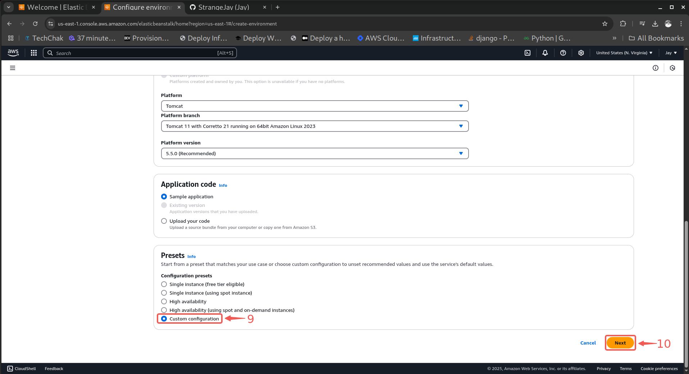
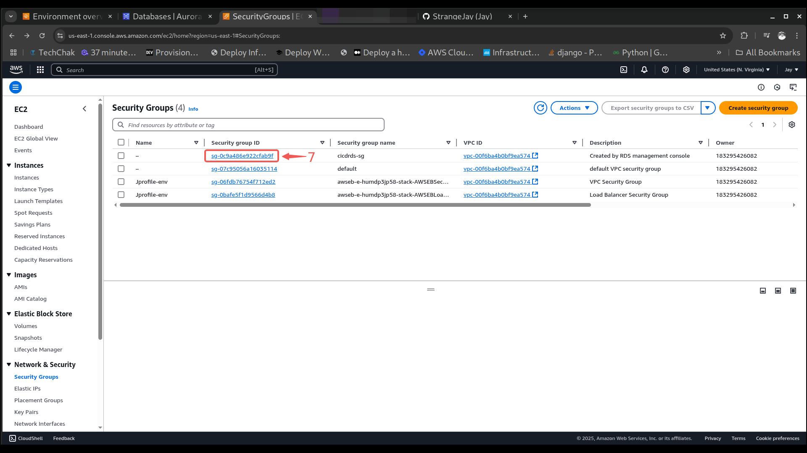
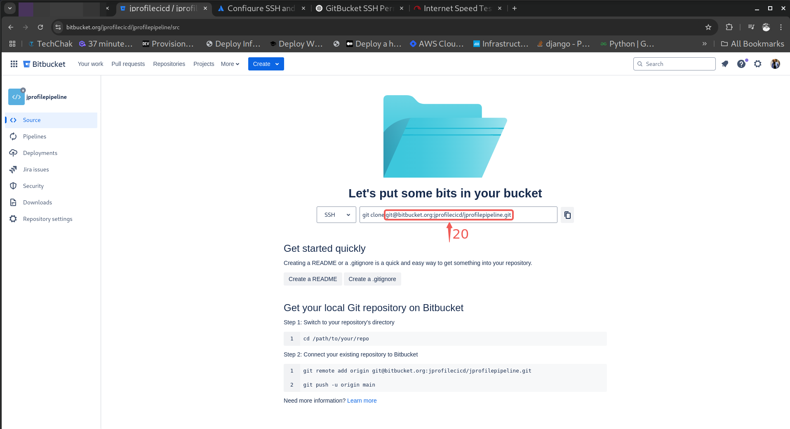
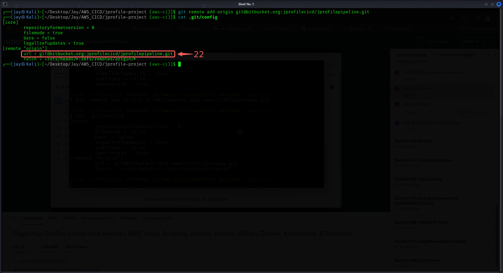
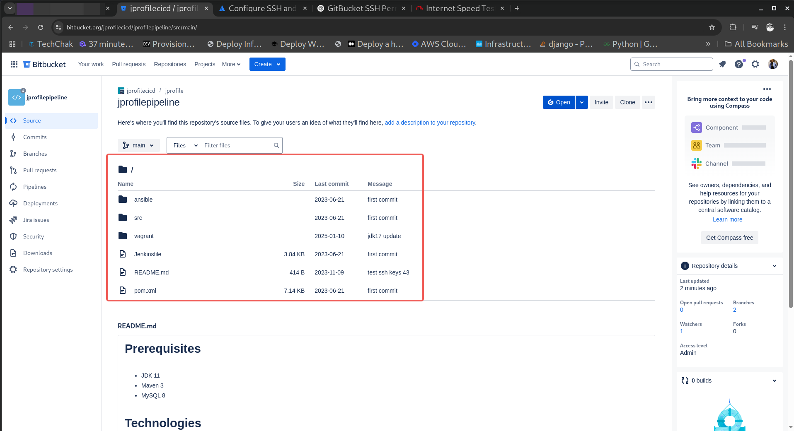
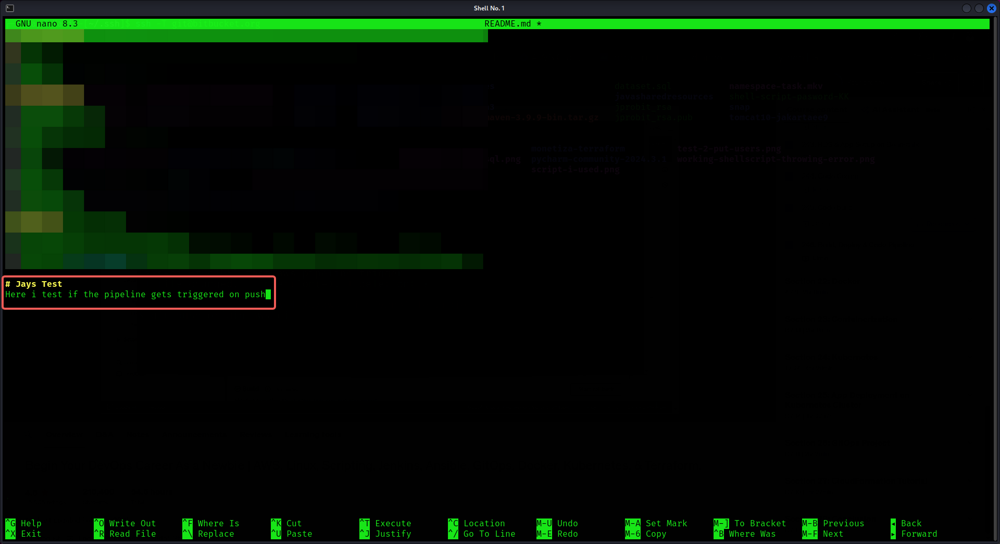

# Build a CI/CD Pipeline with AWS CodeBuild, CodeCommit, and CodeDeploy

## Introduction

Continuous Integration and Continuous Deployment (CI/CD) pipelines are essential for modern software development, enabling automated code testing, building, and deployment. AWS offers a suite of services—AWS CodeBuild, AWS CodeCommit, and AWS CodeDeploy—that streamline the CI/CD process, reducing manual effort and improving deployment efficiency.

In this guide, we will walk through the process of setting up a fully automated CI/CD pipeline to deploy an application to AWS Elastic Beanstalk. The pipeline will be configured to automatically build and deploy application updates whenever changes are pushed to a Bitbucket repository.

Initially, our codebase is hosted on GitHub, but we will migrate it to Bitbucket to align with our pipeline requirements. Bitbucket provides a seamless integration with AWS, allowing us to trigger builds and deployments efficiently. We will use AWS CodeCommit as an intermediate step to facilitate integration between Bitbucket and AWS services.

Additionally, we will create and initialize our own database, ensuring the application has a properly configured data layer before deployment. This step will involve:

- Setting up a managed database service (Amazon RDS)

- Running database migrations and seeding initial data

## What You’ll Learn in This Guide:

- **Migrating Code from GitHub to Bitbucket** – Moving an existing repository while preserving version history.

- **Setting Up AWS CodeCommit** – Acting as a bridge between Bitbucket and AWS services.

- **Configuring AWS CodeBuild** – Automating the build process to compile, test, and package the application.

- **Setting Up AWS CodeDeploy** – Automating deployments to AWS Elastic Beanstalk.

- **Creating a Database and Initializing It** – Provisioning a database and running migrations/seeding.

- **Creating an AWS CodePipeline** – Automating the entire CI/CD workflow.

- **Testing the CI/CD Pipeline** – Ensuring seamless integration and automatic deployments.

By the end of this guide, you will have a fully functional CI/CD pipeline that automates application deployment to AWS Elastic Beanstalk, along with a properly configured database, ensuring a complete and efficient deployment setup.

---

## CI/CD Project

|S/N | Project Tasks                              |
|----|--------------------------------------------|
| 1  |Create a key pair                           |
| 2  |Set up elastic beanstalk                    |
| 3  |Create an RDS database                      |
| 4  |Initialise database                         |
| 5  |Setup Bitbucket                             |
| 6  |Create an s3 bucket to save your artifact   |
| 7  |Setup Code Build                            |
| 8  |Setup Code Pipeline                         |
| 9  |Test Setup                                  |

## Checklist

- [x] Task 1: Creating a key pair
- [x] Task 2: Create an EC2 Instance Profile
- [x] Task 3: Set Up Elasticbeanstalk
- [x] Task 4: Create RDS Database
- [x] Task 5: Edit RDS security group to allow inbound traffic from the e2 instances created by ElasticBeanstalk
- [x] Task 6: Initialise Database
- [x] Task 7: Set up the Code base
- [x] Task 8: Set up s3 bucket for artifact storage
- [x] Task 9: Set up Code Build
- [x] Task 10: Set up code pipeline
- [x] Task 11: Test your pipeline

**Project repo:** [**jprofile**](https://github.com/StrangeJay/jprofile-project/tree/aws-ci)

## Documentation

### Create a Key Pair

- Enter 'key pairs' in the search field and select **Key pairs**① from the displayed options.


- Click the **Create key pair**② button to proceed.


- Provide a **Name**③ for the key pair and click **Create key pair**④.


---

### Create an EC2 Instance Profile

- Enter **IAM**① in the search bar and choose **IAM**② from the displayed services.


- Navigate to **Roles**③ by clicking on it.


- Click the **Create role**④ button.


- Click the **chevron icon**⑤, then select **EC2**⑥ from the dropdown menu.


- Click on **Next**⑦ to proceed.


- In the search field, search for **bean**⑧, and select the four policies shown in the image:

    - **AdministratorAccess-AWSElasticBeanstalk**: This policy grants full administrative access to AWS Elastic Beanstalk and its associated resources. It allows a user or role to create, update, and delete Elastic Beanstalk applications, environments, and configurations. It also provides permissions to manage EC2 instances, load balancers, auto-scaling groups, and other resources Elastic Beanstalk provisions.
    - **AWSElasticBeanstalkCustomPlatformEC2Role**: This policy is designed for EC2 instances that run custom Elastic Beanstalk platforms. It provides the necessary permissions for instances to download platform components, manage logs, and interact with other AWS services needed to run a custom platform.
    - **AWSElasticBeanstalkRoleSNS**: This policy allows Elastic Beanstalk to send notifications via Amazon Simple Notification Service (SNS). It enables Elastic Beanstalk to publish messages related to application and environment events, such as deployment statuses or failures, which can then trigger alerts or automated actions.
    - **AWSElasticBeanstalkWebTier**: This policy is intended for instances in the web tier of an Elastic Beanstalk environment. It grants permissions for web servers to interact with Elastic Beanstalk, manage logs, and perform basic operations required for hosting web applications. It ensures that web-tier instances can function properly within the Elastic Beanstalk-managed infrastructure.


- Click **Next**⑨ to proceed.


- Provide a **Role name**⑩ and **Description**⑪.


- Click **Create role**⑫ to finalize the process.


---

### Set up your Elastic Beanstalk Environment

#### Configure environment

- Enter 'beanstalk' in the search field, then select **Elastic Beanstalk**① from the search results.


- Click **Create application**② to begin the process.


- Enter your **Application name**③, and in the Environment information section, provide your **Environment name**④ and **Domain**⑤, then **check availability**⑥.


> [!NOTE]
It is essential that the domain name is unique, since it will be used to construct the URL.

- Since our app runs on Tomcat, click the **chevron icon**⑦ and select **Tomcat**⑧ as the platform.


- Choose **custom configuration**⑨ in the Presets section, then click **Next**⑩.



#### Configure service access

- For service roles, select **Create and use new service role**①, then click the **chevron down icon**② and choose your created key pair.


- Click within the empty field to select your created **EC2 instance profile**③, and proceed by clicking **Next**④.


#### Set up networking, database, and tags

- Click the **chevron icon**① to open the dropdown menu, then select the **default vpc**②.


- Ensure public IP address is **Activated**③ and select all **Availability Zones**④.


- Click the **Add new tag**⑤ button.


- Specify a **Key**⑥ and **Value**⑦ pair, and proceed by clicking **Next**⑧.


#### Configure instance traffic and scaling

- Click on the Root volume type field, then choose **General Purpose 3(SSD)**① from the options.


- Within the Auto Scaling group section, choose the **Load balanced**② option.


- Specify the desired minimum and maximum number of **Instances**③ to be provisioned.


- Scroll down to Instances types and change it to **t2.micro**④ to remain within the free tier limits.


- Within the Processes section, click the **radio button**⑤ to select it, then click **Actions**⑥.


- Choose **Edit**⑦.


- Click the **Chevron down icon**⑧ next to Sessions, verify that Session stickiness is **Enabled**⑨, and then click **Save**⑩.


- Click the **Next**⑪ button.


#### Configure updates, monitoring, and logging

- Within the Application deployments section, click on the Deployment policy field, then choose **Rolling**① from the options.


- Specify the **Deployment batch size**② you want to use.


> [!NOTE]
For this example, we are using a Deployment batch size of 50%. However, in a production environment with multiple instances, it's recommended to select no more than 25%, ideally around 10% to deploy to one instance at a time.

- Click the **Next**③ button.


- Take a moment to review your settings, and then click **Submit**④.


- Your Elastic Beanstalk environment is currently being created. This process may take some time, so while you wait, proceed to the next step.


---

### Create an RDS Database

- Enter **RDS**① in the search bar and choose **Aurora and RDS**② from the displayed services.


- Click **Create database**③ to begin setting up a new database.


- Select **MySQL**④.


- Choose the **Free tier**⑤ option to keep your database usage within the free tier.


- Provide a unique **DB instance identifier**⑥, then select the **Auto generate password**⑦ option.


- In the VPC section, select **Create new**⑧ and type in your **New VPC security group name**⑨.


- Click on the **chevron icon**⑩ next to Additional configuration.


- Enter your desired **Initial database name**⑪.


> [!NOTE]
It's important for this exercise that you name your initial database 'accounts' to match the configuration in our codebase.

- Click on **Create database**⑫.


- **Close**⑬ the pop up message.


- Click **View credential details**⑭ to get the credentials for your database.


- Copy the displayed details and save them in a secure note.


---

### RDS Security Group Setup

- Search for ec2 in the search bar and then select **EC2**① from the services.


- Click on **Instances**②.


- Make a note of the two servers provisioned by Elastic Beanstalk.


- Choose one of the **servers**③ created and then click the link to its **Security group**④.


- Copy the **Security group ID**⑤ of the EC2 instances and then go to **Security Groups**⑥ under the Network & Security tab.


- Click the **Security group ID**⑦ of the security group created by RDS.



- Click **Edit inbound rules**⑧.


- Click the **Add rule**⑨ button.

 

- Search and select **MYSQL/Aurora**⑩.


- Paste in the **security group ID**⑪ of the instances you copied earlier, and click **Save rule**⑫.


- Return to the **Instances**⑬ page.


---

### Initialise Database

- Select any of the **instances**① and copy its **Public IPv4 address**②.


- Execute the following command in your terminal **`ssh -i <"key pair name"> ec2-user@ec2-<Public IP>.compute-1.amazonaws.com`**.


> [!NOTE]
Make sure to replace <key pair name> with the exact name of your key pair file and <PUBLIC IP> with your Public IP address. When replacing the Public IP, substitute the dots (.) with dashes (-). For example: `ssh -i "cicdbeankey.pem" ec2-user@ec2-3-90-183-88.compute-1.amazonaws.com`.

- Run the command **`dnf search mysql`①** to search for MySQL packages, and then copy the name of the **mysql client name**② package from the results.


- Run the following command **`dnf install mariadb105`**.


- Execute this command in your terminal: **`mysql -h <your rds endpoint> -u <your user> -p accounts`**. Making sure to substitute your RDS endpoint for `<your rds endpoint>` and your username for `<your user>`. When prompted, enter your password to log in to the 'accounts' database, and once you've verified that you can access it, type `exit` to disconnect.


- Go to the [schema page](https://github.com/StrangeJay/jprofile-project/blob/aws-ci/src/main/resources/db_backup.sql) and click **Raw**③.


- Copy the **URL**④ from your browser's address bar.


- Return to your terminal window and execute this command to download the 'db_backup.sql' file: **`wget https://github.com/StrangeJay/jprofile-project/blob/aws-ci/src/main/resources/db_backup.sql`**.


- Execute the first command below in your terminal to import the 'db_backup.sql' file into your 'accounts' database. Make sure to replace `<your rds endpoint>` and `<your user>` with your RDS endpoint and username: **`mysql -h <your rds endpoint> -u <your user> -p accounts < db_backup.sql`**. Then, run the second command to log in: **`mysql -h <your rds endpoint> -u <your user> -p accounts`**.


- Run the SQL command **`show tables;`** in your MySQL prompt. This will list the tables in your current database. Compare this list with the tables shown in the image to confirm they match.


### Set Up Your Code Repository

- Go to [**Bitbucket**](https://bitbucket.org/product) and create a Bitbucket account if you don't have one yet.

- Click on **Create a workspace**①.


- Provide a **Name**② for your workspace in the designated field, and then click the **Agree and create workspace**③ button.


- Select **Create repository**④.


- Fill in the necessary details and click on **Create repository**⑤.


> [!NOTE]
When creating the repository, ensure it's empty. Do not add a README file or a .gitignore file, as we will be migrating our existing GitHub repository here.

- To check for existing SSH keys on your system, go to your terminal and run the following command: **`ls .ssh/`**.


> [!NOTE]
You can either use the existing ssh key or create a new one.

- Run the command **`cat <public key name>`** to display your **public key**⑥, and then copy the displayed key.


> [!NOTE]
Make sure to replace `<public key name>` in the command with the actual filename of your public key.

- Click the **gear icon**⑦ and then select **Personal Bitbucket settings**⑧ from the menu.


- Select **SSH keys**⑨ from the left-hand menu, and then click the **Add key**⑩ button.


- In the form provided, fill in the necessary **details**⑪. Give your SSH key a descriptive name, paste the public key you copied earlier into the designated field, and then click **Add key**⑫.


- Return to your terminal and create a configuration file. This setup will allow Git to use your private SSH key for authentication when you perform `git push` or `git pull` operations with your Bitbucket repository.

- In your terminal, run the following commands to create and edit the SSH config file: **`cd ~/.ssh && nano config`**. Once the nano text editor opens, paste the following configuration, making sure to replace `~/.ssh/<private key name>` with the actual path to your private key file:
```
# bitbucket.org
Host bitbucket.org
  PreferredAuthentications publickey
  IdentityFile ~/.ssh/<private key name>
```


- Run the command **`ssh -T git@bitbucket.org`** in your terminal to test your SSH connection to Bitbucket. If the connection is successful, you should see a message similar to the one shown in the image.


- Go back to the [Code repository](https://github.com/StrangeJay/jprofile-project/tree/main) on github and click the **Code**⑬ button.


- Select the SSH option and then **copy**⑭ the displayed URL.


- Run the following command to download the codebase to your local machine: **`git clone git@github.com:StrangeJay/jprofile-project.git`⑮**. Once the download is complete, navigate into the repository directory by running: **`cd jprofile-project`⑯**.


- Run the command **`git checkout aws-ci`⑰** to switch to the 'aws-ci' branch.


- Run the command **`cat .git/config`⑱** to view the remote repository that your local repository is currently tracking. Then, run **`git remote rm origin`⑲** to remove the connection to the GitHub repository.


- Go back to your repository on Bitbucket. Locate the **SSH clone command**⑳ and copy the portion of the URL that comes after git clone, as shown in the image below.



- Go back to your terminal and run the following command, replacing `<copied Bitbucket SSH url>` with the SSH URL you just copied from Bitbucket: **`git remote add origin <copied Bitbucket SSH url>`㉑**.


- Run the command `cat .git/config`  again in your terminal. Verify that the [remote "origin"] section now shows the **bitbucket url**㉒ you just added.



- Run the command **`git push origin --all`㉓** to push all local branches (including 'main' and 'aws-ci') to your Bitbucket repository. After running the command, confirm in your Bitbucket repository that **both branches**㉔ ('main' and 'aws-ci') have been successfully pushed.


- Go back to your Bitbucket repository to verify that the code and branches have been successfully pushed.



- On Bitbucket, click the **chevron down icon**㉕ located near the 'main' branch name. A dropdown menu should appear, where you should confirm that you see both the **main and aws-ci branches**㉖ listed.


---

### Create an S3 Bucket

- Go to your AWS console, search for 'S3' in the search bar, and select **S3**① from the list of services.


- Click on **Create bucket**②.


- Provide a **Bucket name**③.


- Click on **Create bucket**④ to create the bucket.


> [!NOTE]
Just give your bucket a name and create it, leave every other setting on default.

---

### Set Up Code Build

- In your AWS console, use the search bar to find 'CodeBuild', and then choose **CodeBuild**① from the displayed services.


- Click on **Create project**②.


- Enter a **Project name**③ in the designated field.


- In the Source provider section, click the **chevron icon**④ and select **Bitbucket**⑤ from the dropdown menu that appears.


- Click on **Manage account credentials**⑥ to connect your AWS CodeBuild project to your Bitbucket account.


- Click the **chevron icon**⑦ and then select **OAuth app**⑧ as the Credential type from the dropdown menu.


> [!NOTE]
While using a Bitbucket access token is the recommended and most secure method, it's a paid feature. Therefore, as long as you are logged into Bitbucket in the same web browser, using OAuth app is a viable alternative.

- Choose **CodeBuild**⑨ and then click the **Connect to Bitbucket**⑩ button.


- Click the **Confirm**⑪ button to finalize the connection.


- You should see a confirmation message indicating that your Bitbucket account has been successfully connected.


- Click in the empty field below 'Repository'. A dropdown menu will appear; select your **Bitbucket repository**⑫ from the list.


- In the 'Source version' field, type the branch name **`aws-ci`⑬**.


- Choose **Ubuntu**⑭ as the operating system for your build environment.


- Scroll down the page until you find the 'Buildspec' section, and then click the **Switch to editor**⑮ button.


- Either download the [**buildspec.yml**](https://github.com/StrangeJay/AWS_CICD/blob/master/buildspec.yml) file to your computer or open it directly in your browser. Once you have access to its contents, copy everything and paste it into the text editor on the AWS CodeBuild page. Next, find and replace the placeholders or fields that need your specific configuration.


> [!NOTE]
This command consists of three sed (stream editor) operations that modify the application.properties file located at `src/main/resources/application.properties`. Each command uses the `sed -i` option to perform an in-place substitution, meaning the file is modified directly without creating a new one.

```
- sed -i 's/jdbc.password=admin123/jdbc.password=nr1mTWY6OvlLBovvmZpD/' src/main/resources/application.properties
- sed -i 's/jdbc.username=admin/jdbc.username=admin/' src/main/resources/application.properties
- sed -i 's/db01:3306/vprodb.c50sgqqusvnr.us-east-1.rds.amazonaws.com:3306/' src/main/resources/application.properties
```

These `sed` commands modify the **`application.properties`** file in **`src/main/resources/`** by updating database credentials and connection details. The first command replaces the database password, changing `jdbc.password=admin123` to `jdbc.password=nr1mTWY6OvlLBovvmZpD`, where `nr1mTWY6OvlLBovvmZpD` is a placeholder and should be replaced with your actual password. The second command attempts to update the database username, but since the replacement value is the same (`admin`), no actual change occurs. The third command updates the database host, replacing `db01:3306` with `vprodb.c50sgqqusvnr.us-east-1.rds.amazonaws.com:3306`, which is an AWS RDS endpoint. All placeholders, including the password and database host, should be replaced with your actual connection details before running these commands. Study this image to see how it should look.


- Copy the complete content of the buildspec.yml file. Then, go back to your AWS console and paste this entire content into the 'Build commands' field.


- Scroll down to the 'Artifacts' section. Under 'Type', select **Amazon S3**⑯ from the available options.


- Click in the 'Bucket name' field. A dropdown menu will appear; select the **bucket**⑰ you created earlier from that list.


- "Enter a **Group name**⑱ and a **Stream name prefix**⑲ for your CloudWatch logs. Once you've done this, click the **Create build project**⑳ button.


- Now that your project is created, click the **Start build**㉑ button to begin the build process.


- Check the build status to confirm that it shows 'Succeeded'.


---

### Set Up Code Pipeline

- In your AWS console, use the search bar to find 'CodePipeline', and then choose **CodePipeline**① from the displayed services.


- Click the **Create pipeline**② button.


- Select the **Build custom pipeline**③ option and then click the **Next**④ button.


- Enter a **Pipeline name**⑤ and then click the **Next**⑥ button.


- Click on the 'Source provider' field. A dropdown menu will appear; select **Bitbucket**⑦ from that list.


- Click the **Connect to Bitbucket**⑧ button to link your Bitbucket account to CodePipeline.


- Enter a **Connection name**⑨ in the provided field and then click the **Connect to Bitbucket**⑩ button.


- Click on **Install a new app**⑪.


- Click the **Grant access**⑫ button.


- Click on **Connect**⑬ to complete the connection.


- Click in the 'Repository' field. A dropdown menu will appear; select your **Bitbucket repo**⑭ from that list.


- Click on the Default branch field and select **aws-ci**⑮ from the dropdown menu.


- Click **Next**⑯.


- Choose **Other build providers**⑰. Next, locate the empty field underneath. Click on it to open a dropdown list, and then select **AWS CodeBuild**⑱ from the options.


- Click in the Project name field and select your **created build project**⑲.


- Click the **Next**⑳ button to proceed to the next step.


- Choose **AWS CodeBuild**㉑ as the test provider for your pipeline.


> [!NOTE]
This step is optional and can be skipped if you prefer.

- Click in the Project name field and select your **build project**㉒.


- Click the **Next**㉓ button.


> [!NOTE]
To avoid issues arising from differences between the previously built artifact and the Source artifact, ensure that you select 'Source artifact' as your input artifact.


- In the deployment stage, choose **AWS Elastic Beanstalk**㉔ as the Deploy provider from the available options.


- Click on the 'Application name' field and select your desired **Application name**㉕ from the options provided.


- Select your **Environment name**㉖.


- Click **Next**㉗.


- Take a moment to review all the pipeline configurations you've set up. Once you're satisfied, click the **Create pipeline**㉘ button.


- Verify that your pipeline has been successfully created. Once confirmed, wait for the pipeline execution to finish.


- If the setup was performed correctly, all stages of your pipeline should show a successful result, indicated by green tick icons.


---

### Test Entire Set Up

- Go to your Elastic Beanstalk environment page. There, click on the **Domain name**① link to open your deployed website.


- If your set up was done right,  a webpage should have loaded. On this page, please enter **`Admin_vp`** as the Username and also **`Admin_vp`** as the Password to log in.


- Congratulations! Your application has been successfully deployed.


- To verify if the pipeline triggers automatically as expected, open your terminal and connect to the repository where your code is stored.



- Make a small modification to one of your code files and then push this change.


- You should now observe that your project has automatically started building again in response to your code push.


---

And with that, the project is complete. You have successfully created an AWS pipeline.